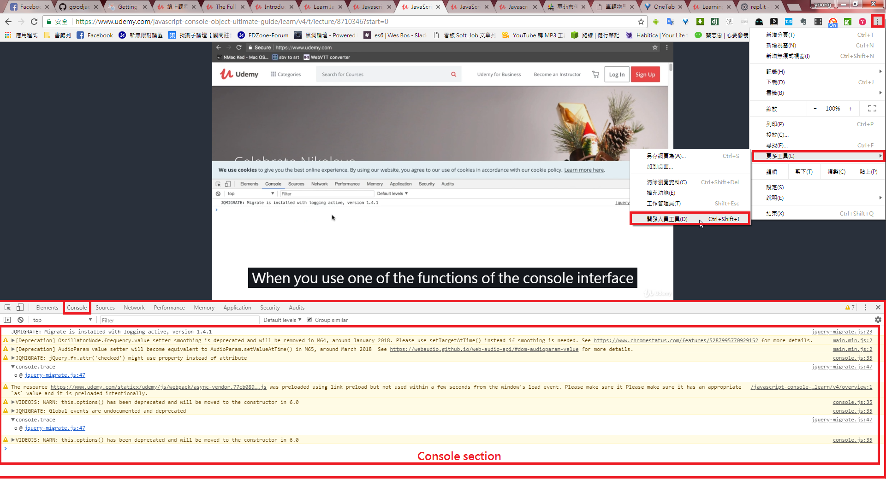

# What is Console object?
Chrome 開發者工具(其他遊覽器也有類似工具)是一套內置於Google Chrome中的Web開發和調試工具，可用來對網站進行迭代、調試和分析。
[Chrome官方Console API說明1](https://developers.google.com/web/tools/chrome-devtools/console/?hl=zh-tw)
[Chrome官方Console API說明2](https://developers.google.com/web/tools/chrome-devtools/console/console-reference?hl=zh-tw)

Keyboard click F12 or go to menu bar and select more tools --> developer tool

## using JQuery library from [CDN](https://code.jquery.com/)
https://code.jquery.com/jquery-3.3.1.min.js

