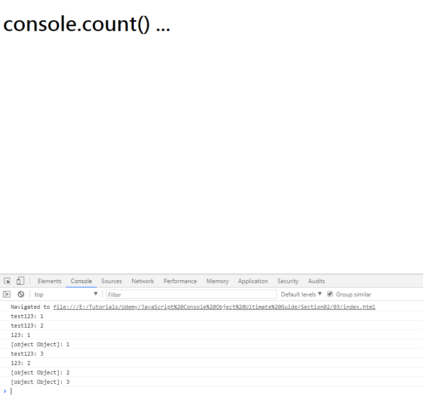

# 01 console.assert(Assertion, ErrorMessage)

使用assert function來作boolean判斷,
若Assertion為true,則不做任何事
若Assertion為false,則顯示 error message
可用在正式環境上,當非預期的數據發生時,便於檢查錯誤

ex:
```javascript
    window.onload = function(){

        // console.assert(Assertion, ErrorMessage);
        // If the assertion is true, nothing happens.
        // If the assertion is false, throw an error message to the console.
    
        $.ajax({
        url: 'https://reqres.in/api/users',
        type: 'GET',
        success: function(response) {
            console.log(response);
            console.assert(true, '[true] show error?');
            console.assert(false, '[false] show error?');
            console.assert(response.per_page === 4, '[Error]: Item numbers per page is not true');
            /*
            Assertion failed: [Error]: Item numbers per page is not true
            */
        }
        });  
    };
```


---

# 02 console.clear()

使用console.clear()來清除console內的文字內容,清除後會顯示console已被清除的資訊
情境1: 某些library會產生一些console訊息,但這些不是我們關注的東西,所以在輸出我們關注的東西前,先將console清除乾淨

ex:
```javascript
    window.onload = function(){

        console.log('雜訊01');
        console.log('雜訊02');
        console.log('雜訊03');
        console.log('雜訊04');
        console.log('雜訊05');

        console.clear();//清除目前console上的訊息內容

        console.log('我們需要的訊息01');
        console.log('我們需要的訊息02');
    };
```


---

# 03 console.count()

使用console.count(xxx)來記錄提供的xxx字符串,以及相同字符串已被提供的次數

ex:
```javascript
    window.onload = function(){

        // console.count(label)
        // Writes the number of times that count() has been invoked
        
        var label1 = 'test123';
        var label2 = 123;
        var label3 = {};

        console.count(label1); // test123: 1
        console.count(label1); // test123: 2
        console.count(label2); // 123: 1
        console.count(label3); // [object Object]: 1
        console.count(label1); // test123: 3
        console.count(label2); // 123: 2
        console.count(label3); // [object Object]: 2
        console.count(label3); // [object Object]: 3
        
    };
```



---

# 04 console.dir() and console.dirxml()

console.dir: 輸出以 JavaScript 形式表示的指定對象。如果正在記錄的對象是 HTML 元素，將輸出其以 DOM 形式表示的屬性.
console.dirxml: 如果可以，輸出 object 子級元素的 XML 表示形式，否則輸出其 JavaScript 表示形式。 在 HTML 和 XML 元素上調用 console.dirxml() 等同於調用 **console.log()**。

ex:
```javascript
    document.getElementsByTagName('h1')[0].textContent = 'console.dir() and console.dirxml()...';

    window.onload = function(){

    // console.dir(object)
    // console.dirxml(object)

    var obj = { a:123, b:'abc', c:true };
    console.dirxml(obj); //
    console.dir(obj);    //

    console.dirxml(document.body); // 會輸出呈現xml的部分而已,即node tag和內容(不會顯示詳細的物件屬性)
    };
    console.dir(document.body); // 會輸出整個JavaScript的物件,包含物件內的所有屬性
```


---

# 05 console.error()

輸出一條類似於 console.log() 的消息，將消息設置成錯誤樣式，並在調用此方法的地方包含一個堆疊追蹤。
icon會變成error且顏色為紅色,**且能產生stack trace來追蹤發生點**,便於快速了解此訊息為異常訊息

ex:
```javascript
    document.getElementsByTagName('h1')[0].textContent = 'console.error() ...';

    window.onload = function(){

        // console.error()

        $.ajax({
            url: 'test.url.co.uk',
            type: 'GET',
            error: function errCallback(errorResponse) {
            console.error(errorResponse.statusText);
            }
        })

    };
```


---

# 06 console.group() and console.groupCollapsed() and console.groupEnd()

console.group(object[, object, ...]): 啓動一個帶有可選標題的新log群組。以可視化方式將在 console.group() 後、console.groupEnd() 前發生的所有console.log組合在一起。
console.groupCollapsed(object[, object, ...]): 創建一個初始處於摺疊狀態而不是打開狀態的新log群組。

ex:
```javascript
    document.getElementsByTagName('h1')[0].textContent = 'console.group() and console.groupCollapsed() and console.groupEnd() ...';

    window.onload = function(){

        // console.group()
        // console.groupCollapsed()
        // console.groupEnd()

        $.ajax({
          url: 'https://reqres.in/api/users',
          type: 'GET',
          success: function(response) {

            var users = response.data;
            
            // 假設當我們只要呈現部份數據內容但要將相關的資料群組在一起時，可利用group方式
            for(var i = 0; i <users.length; i++){
                //將內容group成一個便於console顯示
                console.group('User');
                console.log(users[i].id);
                console.group('Name'); // 群組內的子群組
                  console.log(users[i].first_name);
                  console.log(users[i].last_name);
                console.groupEnd();
                console.log(users[i].avatar);
                console.groupEnd();
            }


            for(var i = 0; i <users.length; i++){
                //將內容group成一個便於console顯示並一開始就收合起來
                console.groupCollapsed('User');
                console.log(users[i].id);
                console.group('Name'); // 群組內的子群組
                  console.log(users[i].first_name);
                  console.log(users[i].last_name);
                console.groupEnd();
                console.log(users[i].avatar);
                console.groupEnd();
            }
          }
        });
    };
```


---

# 07 console.info()

各遊覽器console.info顯示時所使用的icon不太一樣.
輸出一條類似 console.log() 的消息，但同時在輸出旁顯示一個圖標（帶白色“i”的藍色圓圈）。

ex:
```javascript
    document.getElementsByTagName('h1')[0].textContent = 'console.info() ...';

    window.onload = function(){

        // console.info()
       
        console.log('This is console.log()');
        console.info('This is console.info()');

    };
```


---

# 08 console.log()

在控制檯中顯示一條消息。將一個或多個對象傳遞到此方法。每個對象都會進行評估並級聯到一個由空格分隔的字符串中。

[格式說明符](https://developers.google.com/web/tools/chrome-devtools/console/console-write?hl=zh-tw#_8)
您傳遞的第一個對象可以包含一個或多個格式說明符。格式說明符由百分號 (%) 與緊跟其後面的一個字母組成，字母指示要應用的格式。

ex:
```javascript
    document.getElementsByTagName('h1')[0].textContent = 'console.log() ...';

    window.onload = function(){

        // normal log
        console.log('This is console.log()');
    
    
        // advanced:
        console.log('Color: %s, Number: %d, Float: %f','Red', 123456, 3.1415);
        console.log('[JavaScript Object]object: %O',document.body); // 將值格式化爲可擴展 JavaScript 對象
        console.log('[XML object]object: %o',document.body); // 將值格式化爲可擴展 DOM 元素。如同在 Elements 面板中顯示的一樣


        // advanced + CSS-Style: (用4個%c來設定每個區段的style)
        console.log('[Advanced]Color: %c%s, Number: %c%d,' + ' %cFloat:%c' + ' %f',
                 'color:red; font-weight: 700', 'Red', 
                 'font-size:2em;color: green;', 123456, 
                 'font-size:3em;color: blue;','', 
                 3.1415);
    };
```


---

# 09 console.table()

將數據以表格方式呈現,此方法接收一個強制的參數,且必須是陣列或物件,還可接受一個額外的參數來描述表格的列數.


ex:
```javascript
    document.getElementsByTagName('h1')[0].textContent = 'console.table() ...';

    window.onload = function(){

        // console.table()

        var arr = [
                    { name:'Test01', age:18, isDone: true },
                    { name:'Test02', age:19, isDone: false },
                    { name:'Test03', age:20, isDone: true },
                    { name:'Test04', age:21, isDone: false },
                    { name:'Test05', age:22, isDone: true }
                ];

        // show array
        console.group('show array with console.table');
        console.table(arr); 
        console.groupEnd();

        // show object
        console.group('show object with console.table');
        console.table(arr[0]);
        console.groupEnd();

        $.ajax({
            url: 'https://reqres.in/api/users',
            type: 'GET',
            success: function callback(response) {

            var users = response.data;
            console.table(users);//在console中,將數據用表格方式呈現
            }
        });
    };
```


---

# 10 console.time(label) and console.timeEnd(label)

啓動一個具有關聯標籤的新計時器。使用相同標籤調用 console.timeEnd() 時，定時器將停止，經過的時間將顯示在控制檯中。計時器值精確到亞毫秒。傳遞到 time() 和 timeEnd() 的字符串必須匹配，否則計時器不會結束。

ex:
```javascript
    document.getElementsByTagName('h1')[0].textContent = 'console.log() ...';

    window.onload = function(){

        // console.time()
        // console.timeEnd()

        var timerLabel = "Array initialize";
        console.time(timerLabel);
        
        var array = new Array(1000000);
        for (var i = array.length - 1; i >= 0; i--) {
          array[i] = new Object();
        }

        console.timeEnd(timerLabel);
    };
```


---

# 11 console.trace(object)

從調用此方法的位置輸出一個堆疊追蹤。
可用在debug時,追蹤function的調用者.

ex:
```javascript
    document.getElementsByTagName('h1')[0].textContent = 'console.trace(object) ...';

    window.onload = function(){

      // console.trace(object)

      //-------------------------------------------
      //example 1
      add(3); 

      function add(num) {
        if(num > 0){
            // you can pass labels and objects to trace, yoo
            console.trace('Recursion is fun:', num);// 查看每一層遞迴的參數值變化
            return num + add(num - 1);
        }
        else{
            return 0;
        }
      };

      //-------------------------------------------
      //example 2 : 可用來追蹤調用的方法
      var func1 = function(){ console.trace('test stack trace');  }
      var func2 = function(){ func1(); }
      var func3 = function(){ func2(); }

      func3(); // func3調用func2,func2調用fun1
    };
```


---

# 12 console.warn(object [, object, ...])

輸出一條類似 console.log() 的消息，但同時在記錄的消息旁顯示一個黃色警告圖標。


ex:
```javascript
    document.getElementsByTagName('h1')[0].textContent = 'console.wran() ...';

    window.onload = function(){

      // console.warn(object [, object, ...])

      console.wran('This is warning message !!!');
    };
```

